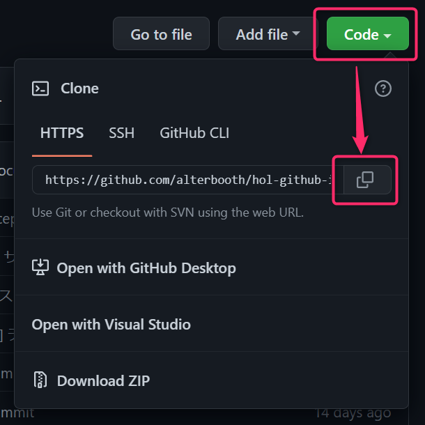

# サンプルコードをローカルで動かす

[本章完了までの時間の目安: 10 分]

この章では、[テンプレートリポジトリ](https://github.com/alterbooth/hol-github-intermediate-sample-template)のサンプルコードをローカル実行します。

まず、リポジトリの「Use this template」を押して、このテンプレートをコピーしたリポジトリを自分のアカウントに作成します。


「use this template」を押すと以下の画面が出ますので、`Owner`で自分のアカウントを選び、`Repository name`に`hol-github-intermediate-sample`と入力します。公開範囲は「Public」とし、「Create repository from template」を押します。


次に、ご自身のリポジトリをクローンします。



その後、ターミナルから　src　ディレクトリへ遷移し、各種コマンドを実行します。  
コマンド例は下記の通りです。

```bash
cd hol-github-intermediate-sample/src
# ローカル開発用証明書の登録
dotnet dev-certs https --trust 
# パッケージ展開
dotnet restore SampleApplication.csproj
# ビルド
dotnet build SampleApplication.csproj
# 実行
dotnet run SampleApplication.csproj
```

コマンド実行後、ブラウザから https://localhost:5001/ へアクセスします。  
以下スクリーンショットのように表示されたら成功です。


違う画面(WebApp のデフォルト画面)が表示される場合は、ブラウザの再読み込みをしてください。  
再読込をしても変わらない場合は、デプロイ時に選択したディレクトリが間違っていないか確認してください。

確認できたら、ターミナルで Ctrl+C で`dotnet run SampleApplication.csproj`で起動しているアプリを停止します。

---

＞[次のステップ（3. サンプルコードを Azure 環境にデプロイする)](./03_deploy-sample-code.md)  
＞[TOP](./../README.md)