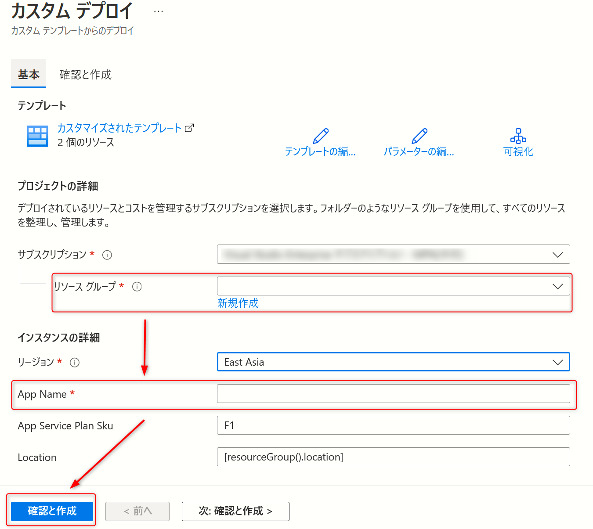
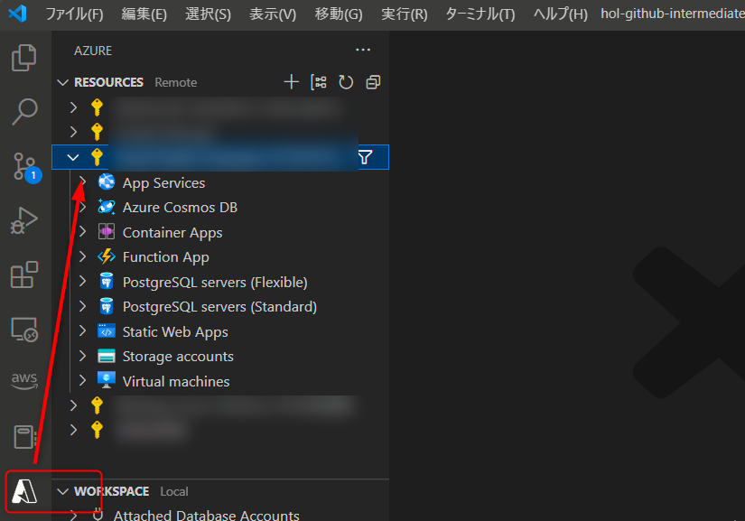
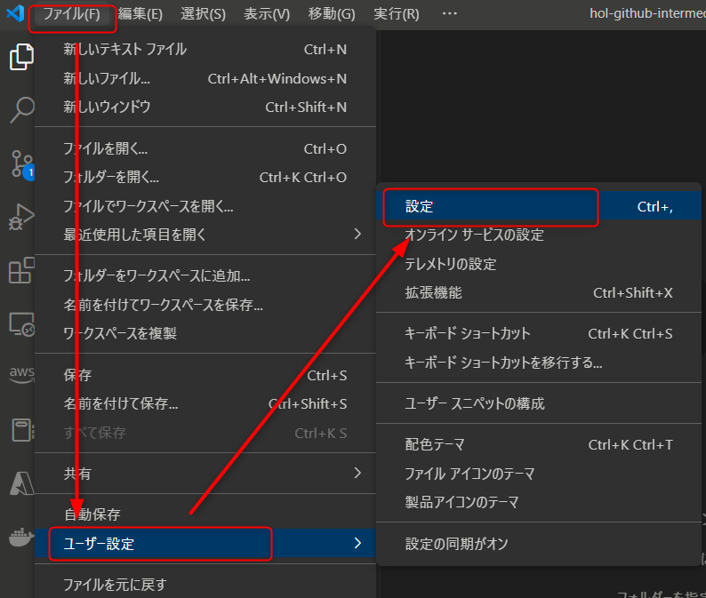
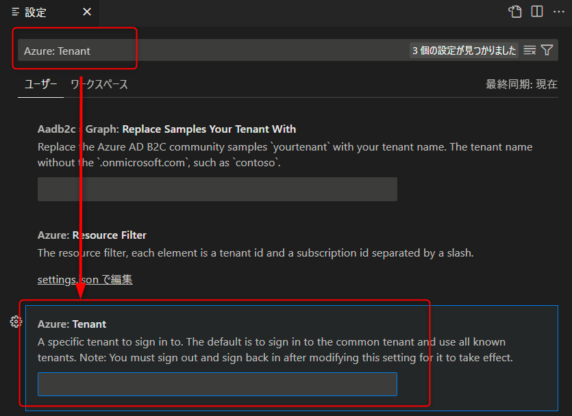
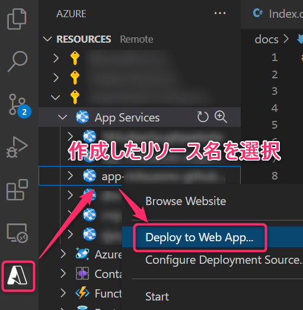
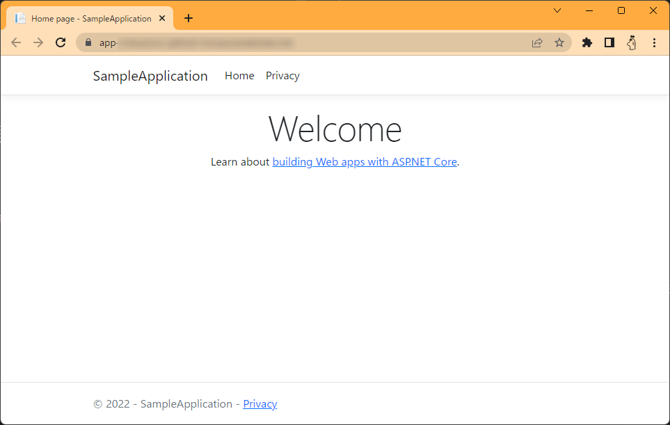

 # サンプルコードを Azure 環境にデプロイする

[本章完了までの時間の目安: 15 分]

この章では、前章で使用したサンプルコードを Azure 環境へデプロイします。

まず、必要な Azure リソースを作成します。  
下記ボタンを押下し、ご自身の Azure サブスクリプション上にリソースを作成します。

[](https://portal.azure.com/#create/Microsoft.Template/uri/https%3A%2F%2Fraw.githubusercontent.com%2Falterbooth%2Fhol-github-intermediate-sample-template%2Fmain%2Fmain.json)

ボタンを押すと以下の画面になるので、リソースグループと App Name を入力してください。リソースグループは「新規作成」を押すことで新規に作成できます。サブスクリプションはご自身の環境に合わせて選択してください。



確認できたら「作成」を押します。数分程度でリソースが作成されます。

もしデプロイに失敗する場合は、プランの部分を「F1」から「D1」に変更して再度「作成」を押してください。

次に、アプリケーションをデプロイします。  
下記コマンドで Release パッケージを生成します。

```bash
dotnet publish -c Release -o ./bin/Publish
```

以下の手順に従い、 VSCode からデプロイを行います。  
初めての場合は以下の画面のようにリソースが表示されていないので、「Sign in to Azure」を押して、先ほどリソースを作成した Azure アカウントでサインインしてください。  



もしデプロイ先のリソースを作成した Azure サブスクリプションが表示されない場合、サインインしたアカウントのディレクトリが規定ではない可能性があります。その場合、「ファイル>ユーザー設定>設定」を選択します。



検索窓に「 Azure: Tenant 」を入力し、該当の設定に対象のテナント ID を入力します。



保存したら、「F1」キーを押してコマンドパレットを開き、「Azure: Sign Out」を選択・実行します。続けて、再度コマンドパレットを開き、「Azure: Sign In」を選択・実行します。これでサブスクリプションが表示されることを確認してください。

以下のように作成したリソースが表示されたら、リソースを右クリックし、「Deploy to Web App」を選択します。



※デプロイフォルダ選択時は **Browse** を選択し、先ほどのコマンドで作成した `src/bin/Publish` フォルダを選択してください。

デプロイ完了後、先程のスクリーンショットに載っていた「Browse Website」を選択し、デプロイ先のページへアクセスします。  
以下スクリーンショットのように表示されたら成功です。



---

＞[次のステップ（4. 継続的インテグレーションを実践する）](./04_continuous-integration.md)  
＞[TOP](./../README.md)