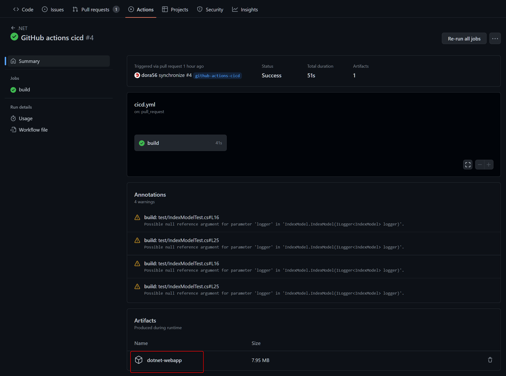
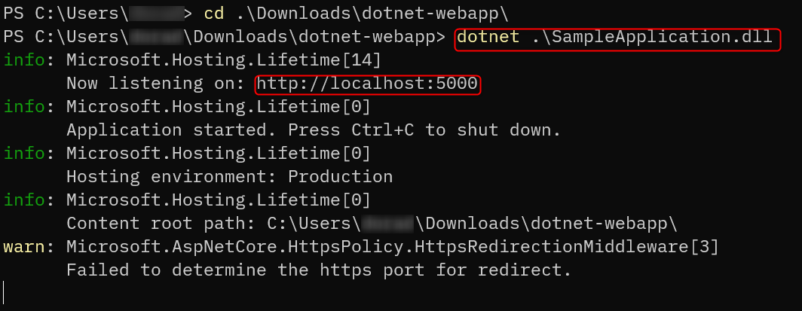
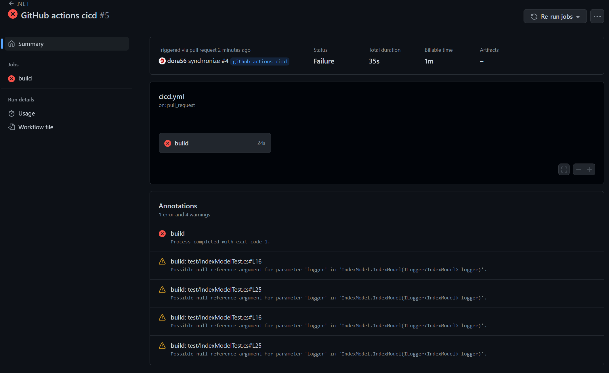
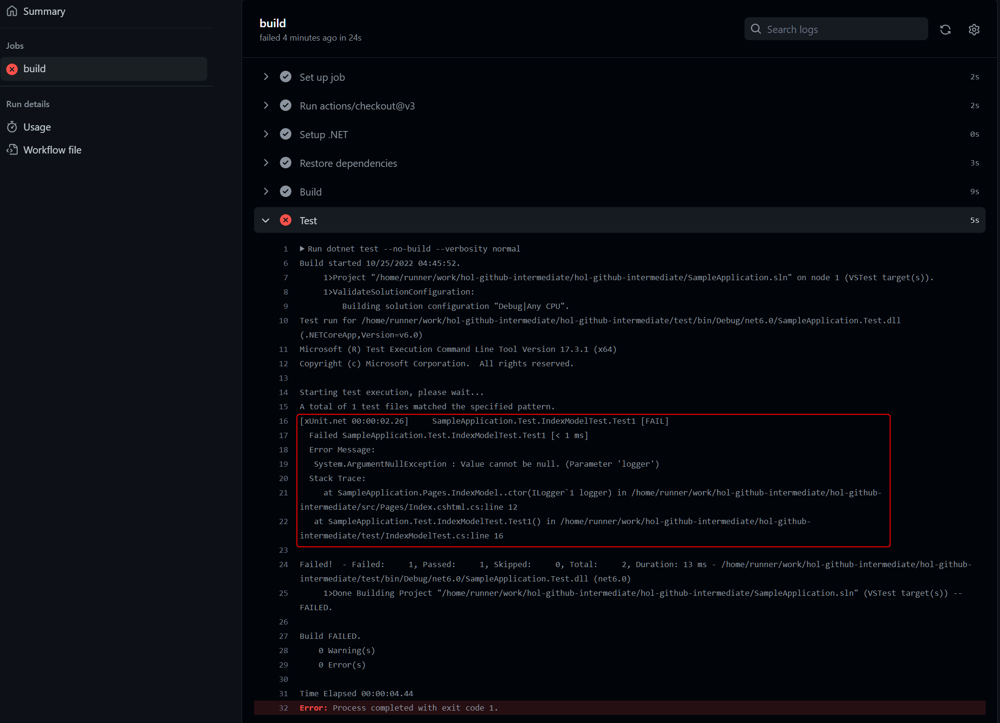
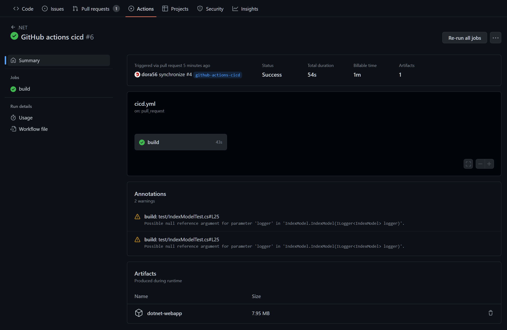

# 継続的インテグレーションを実践する

[本章完了までの時間の目安: 40 分]

この章では、 GitHub Actions を使って継続的インテグレーション（CI）を実現します。

## 用語

### GitHub Actions

GitHub Actions はビルド、テスト、デプロイなどアプリケーション構築のワークフローを自動化、効率化するための継続的インテグレーションと継続的デリバリー  (CI/CD)  のプラットフォームです。  
Git のプッシュやプルリクエストなどイベントをトリガーとするワークフローを作成することでビルドやテストを自動的に実行できます。

### ワークフロー

1 つまたは複数のジョブを自動実行する一連の動作のことです。リポジトリの`.github/workflows/`以下の YAML ファイルでワークフローを定義できます。

### イベント

ワークフローの実行トリガーのことです。プルリクエストの発行時や Issue のオープン時などの設定が可能です。

### ランナー

ワークフローがトリガーされたときにワークフローを実行するサーバーのことです。 GitHub がホストしているランナーは Ubuntu 、Windows 、macOS の環境が提供されています。別の OS や特定のハードウェア環境が必要な場合は自前ホストのランナー(self-hosted runners)で実行も可能です。

### ジョブ

同一ランナー上で実行される、ワークフローの一連の実行ステップのことです。  
各ステップは、シェルスクリプトやコマンドまたはアクションの実行ができます。ステップは順番に実行され、相互に依存できます。たとえば、あるステップから別のステップにデータ共有が可能です。（ビルド後、成果物を使ってテスト実行　など）また、ジョブはデフォルトでは並列実行されます。複数のジョブの依存関係を構成した場合、あるジョブの完了を待ってから次のジョブを実行させることも可能です。

### アクション

GitHub Actions 用のカスタムアプリケーションのことです。とくに、複雑なタスクや、頻繁に繰り返されるタスクを簡略化するために使用されます。例： Git リポジトリのチェックアウトや dotnet コマンドの使用するための環境構築など。

## ワークフローの例

```yml
name: learn-github-actions
on:
  push:
    branches: [ "main" ] 
  pull_request:
    branches: [ "main" ]
  workflow_dispatch:
jobs:
  check-bats-version:
    runs-on: ubuntu-latest
    steps:
      - uses: actions/checkout@v3
      - uses: actions/setup-dotnet@v3
        with:
          dotnet-version: 6.0.x
      - run: dotnet -v
```

### 例の説明

下記の表ではワークフローを作成するときの各定義について、上記の例に基づいて説明します。

|コード|説明|
|-|-|
|`name: learn-github-actions`|GitHub リポジトリの [アクション] タブに表示されるワークフローの名前。|
|`on:`|`on` キーワードを使うと、ワークフローの実行時にトリガーするイベントを定義できます。 ここでは複数のイベントを定義できます。|
|`push:`<br>&nbsp;&nbsp;`branches: [ "main" ]`|`main`ブランチにコミットがプッシュされるたびにワークフローが自動的に実行されるようにするには`push`イベントを追加します。|
|`pull_request:`|プルリクエストが発生したときに実行されるようにするイベントキーワードです。|
|`workflow_dispatch:`|ワークフローを UI から手動で実行できるようにするイベントです。 |
|`jobs:`|ワークフロー ファイルで実行されるすべてのジョブをグループ化します。|
|`check-dotnet-version:`|`jobs`内に格納されている`check-dotnet-version`という名前のジョブ ID を定義します。|
|`runs-on: ubuntu-latest`|最新版の `Ubuntu Linux` ランナー上でジョブが実行されるように設定します。|
|`steps:`|`check-dotnet-version`ジョブで実行されるすべてのステップをグループ化します。このセクションの下に入れ子になっている各項目は、個別のアクションまたはシェルスクリプトです。|
|`- uses: actions/checkout@v3`|`uses` キーワードは、このステップが [https://github.com/actions/checkout](https://github.com/actions/checkout) で公開されている`actions/checkout` アクションの `v3`(バージョン 3) を実行することを指定します。これはリポジトリをランナーにチェックアウトするアクションで、コードに対してスクリプトやその他のアクション（ビルドツールやテストツールなど）を実行できるようにするものです。ワークフローがリポジトリのコードに対して実行される場合は、常に `checkout` アクションを使用する必要があります。|
|`- uses: actions/setup-dotnet@v3`<br>&nbsp;&nbsp;`with:`<br>&nbsp;&nbsp;&nbsp;&nbsp;`dotnet-version: 6.0.x`|このステップでは、`actions/setup-dotnet@v3`アクションを使用して、指定したバージョンの`dotnet`をインストールします（この例では`version 6.0.x`を使用します）。`dotnet`コマンドが次のステップで使用できるようになります。|
|`- run: dotnet -v`|`run`キーワードは、ランナー上でコマンドを実行するようジョブに指示します。このステップは`dotnet`のバージョンを確認しています。|

## ワークショップ

GitHub Actions のワークフローを作成します。  
ワークフローファイル（例: `cicd.yml`）を `.github/workflows` 配下に作成します。  
下記イベント内容をワークフローファイルに定義します。

- 対象イベント
  - プッシュ
    - 対象ブランチ： main
  - プルリクエスト
    - 対象ブランチ： main
  - 手動

```yml
name: .NET

on:
  xxx: # xxxをプッシュイベントに変えてください
    branches: [ "" ] # mainブランチを対象にしてください
  xxx: # xxxをプルリクエストイベントに変えてください
    branches: [ "" ] # mainブランチを対象にしてください
  xxx: # xxxを手動イベントに変えてください

```

下記の通り、実行環境とジョブ定義を追記します。  
`dotnet restore;build;publish`ができるようにステップを定義します。  
なお、下記`publish`ステップで指定されている``${{env.DOTNET_ROOT}}``環境変数は、ここで利用する`actions/setup-dotnet`の中で定義されています。

```yaml
jobs:
  build:

    runs-on: ubuntu-latest

    steps:
    - # チェックアウトアクションを記入してください
    - name: Setup .NET
      uses: actions/setup-dotnet@v3
      with:
        dotnet-version: 6.0.x
    - name: Restore dependencies
      # この行にBuildステップに対応する形でdotnetのリストアコマンドを記入してください
    - name: Build
      run: dotnet build --no-restore
    - name: Publish
      run: dotnet publish ./src/SampleApplication.csproj -c Release -o ${{env.DOTNET_ROOT}}/webapp
```

ビルド成果物を Artifacts へアップロードするステップを追加します。

```yml
- name: Upload artifact
  uses: actions/upload-artifact@v3
  with:
    name: dotnet-webapp
    path: #ビルド成果物のパスを記入してください
```

YAML ファイルをコミット＆プッシュし、 GitHub のリポジトリの Actions を開きます。  
下記のように成功していることを確認し、ページ下部に Artifact が作成されていることを確認します。  
実行後、 Artifacts にアップロードされたファイルをダウンロードしてください。



コンソールを開き、ダウンロードした ZIP ファイルを展開します。展開したフォルダー直下で`dotnet SampleApplication.dll`を実行してサンプルアプリを起動します。

コンソールに http のアクセスポイントが下記のように表示されます。表示されたアクセスポイントを開き、サンプルアプリが動作していることを確認してください。  
(*) 実行環境によっては http でアクセスしてもすぐに`https://localhost:5001/`にリダイレクトされますが、これは正常な動作です。



次にテストのステップを追記します。
`Build`ステップの次に追加、コミット & プッシュしてください。

```yml
- name: Build
  run: dotnet build --no-restore
- name: Test
  run: dotnet test --no-build --verbosity normal
```

追加後、テストが失敗するので該当のソースコードを修正します。正しく修正出来たかは、ターミナルで以下のコマンドを実行することで確認できます。

```bash
dotnet test
```

正しく修正出来たら、修正内容をプッシュしてください。




プッシュ後、 GitHub Actions のワークフローが成功するのを確認してください。



---

＞[次のステップ（5. 継続的デプロイを実践する）](./05_continuous-deployment.md)  
＞[TOP](./../README.md)
