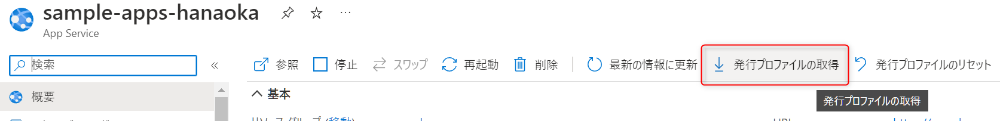
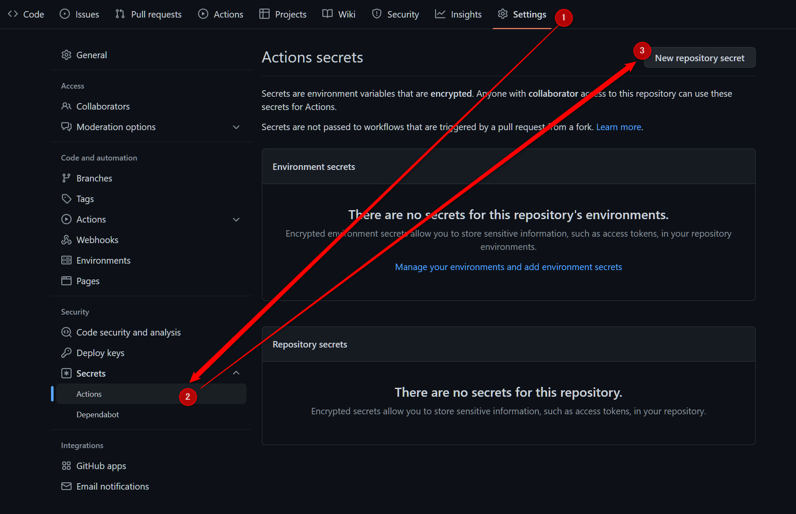
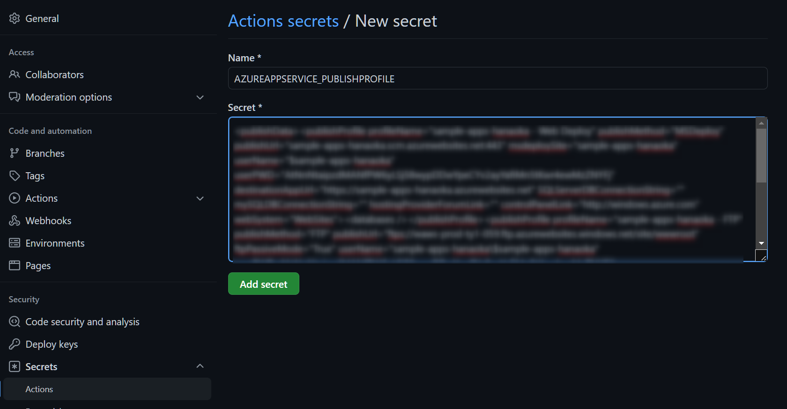

#  継続的デプロイを実践する

[本章完了までの時間の目安: 55 分]

この章では、 GitHub Actions を使って継続的デプロイ（CD）を実現します。

まずは以前作成した Azure の WebApps のリソースから発行プロファイル取得します。
発行プロファイル (.pubxml)とはアプリケーションのデプロイを行うために必要なプロパティや資格情報などを xml 形式で発行されたファイルです。


次にワークフローから発行プロファイルを読み込むために`Secrets`を設定します。  
`Secrets`を使うことで、機密性の高い値や環境変数をワークフローファイルに定義するのではなく、暗号化された GitHub Actions の API から`${{secret.hogehoge}`のような形で参照できます。  
これにより、誤って機密情報がワークフローファイルから漏洩しないように管理できるようになります。  

GitHub リポジトリの`Settings`から`Secrets`>`Actions`>`New repository secret`を選択します。



`AZUREAPPSERVICE_PUBLISHPROFILE`という名前で発行プロファイルの中身を Secret のところに貼り付けて保存します。



次にデプロイをするための環境変数とジョブを前章で書いた YAML ファイルに追加します。

`name`の下に`env`を追加してください。

```yml
name: .NET

env:
  AZURE_WEBAPP_NAME: your-app-name    # Azure Web Appに設定した名前に変えてください
  AZURE_WEBAPP_PACKAGE_PATH: '.'   
```

`jobs`に下記の`deploy`ジョブを追加します。  
`deploy`ジョブは`build`ジョブが成功した後に実行される必要があります。ジョブ間に依存関係を定義する場合、`jobs.<job_id>.needs`を使用すると、指定したジョブが成功した後に`job_id`ジョブが実行されるようになります。

以下の例では、 job1 が成功した後に job2 が実行されます。

```yml

```yml
jobs:
  job1:
  job2:
    needs: job1
```

`deploy`ジョブを追加します。

```yml
jobs:
  build:
    runs-on: ubuntu-latest
  ～～～

  deploy:
    permissions:
      contents: none
    runs-on: ubuntu-latest
    # この行にneedsを挿入してください
    environment:
      name: 'Production'
      url: ${{ steps.deploy-to-webapp.outputs.webapp-url }}

    steps:
      - name: Download artifact from build job
        uses: actions/download-artifact@v3
        with:
          name: # アーティファクト名を記入してください

      - name: Deploy to Azure Web App
        id: deploy-to-webapp
        uses: azure/webapps-deploy@v2
        with:
          app-name: ${{ env. }} # env.の後にアプリ名の環境変数名を記入してください
          publish-profile: ${{ secrets. }} # secrets.の後に定義したSecretの名前を記入してください
          package: ${{ env. }} # env.の後にアプリのパッケージパスの環境変数名を記入してください
```

変更した YAML ファイルをプッシュし、デプロイができるかを確認してください。

## まとめ

今回は GitHub Actions を使って継続的インテグレーションならびに継続的デプロイ(CI/CD)を実現しました。

ここで見てきたように、ソースコードを変更して GitHub にプッシュしたり、プルリクエストをマージしたときに自動的にビルド・テスト・デプロイを実行することができます。これによって、以下のようなことが実現できます。

- ビルドやテストに失敗したコードが長期間リポジトリに残らない

  プッシュ時に自動的にビルドとテストが行われ、失敗した場合はそれが通知されるので即座に気がつくことができます。

- ビルドやテストに失敗したコードがリリースされない

  ビルドやテストのジョブが失敗すると、デプロイのジョブが実行されないので、リリースされることはありません。

- デプロイ作業が自動化されるため、手動作業でのミスを防ぐ

  手動でのデプロイ作業がなくなるので、人為的ミスを防ぐことができます。

リリースマネージメントと GitHub Actions を組み合わせることで、より効率的に開発を進めることができます。また、テストに成功したものを安全にリリースできるため、信頼性の高いアプリケーションを作ることができます。

GitHub Actions でのワークフローには承認フローを追加し、「Staging 環境へのデプロイは承認無しで実行し、Production 環境へのデプロイは複数人の承認が必要」といったことも実現できます。興味のある方は [次のステップ（6. おまけ(早く終わった人向け）](./06_advanced.md) に是非チャレンジしてみてください。

## 後片付け

ハンズオンが終了したら、ポータルから今回作ったリソースを削除します。リソースグループを新規に作成された場合は、リソースグループを消すのが一番簡単です。

リソースグループを削除することができない場合は、`app-(入力したアプリ名)-(ランダムな5文字)`(App Service) と`plan-(入力したアプリ名)-(ランダムな5文字)`(App Service Plan) を削除してください。

**B1 プランは月額費用が発生しますので、不要になったら必ず削除するようにしてください。**  
デプロイ時にデフォルトの F1 プランでデプロイした方は月額費用は発生しませんが、 F1 プランはサブスクリプションごとに利用できる数に制限がありますので不要であれば削除してください。

---


＞[次のステップ（6. おまけ(早く終わった人向け）](./06_advanced.md)  
＞[TOP](./../README.md)