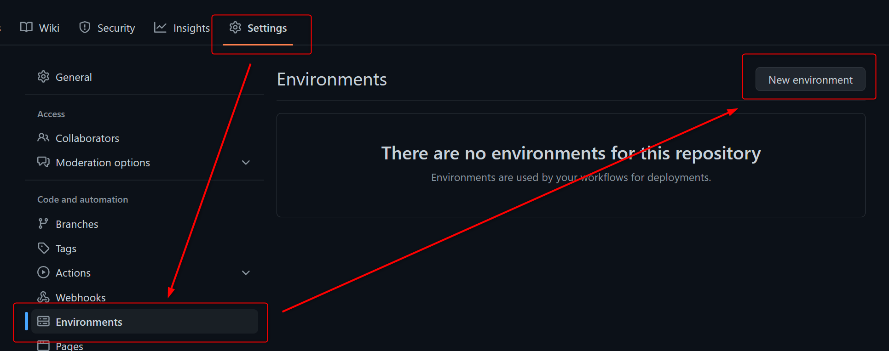
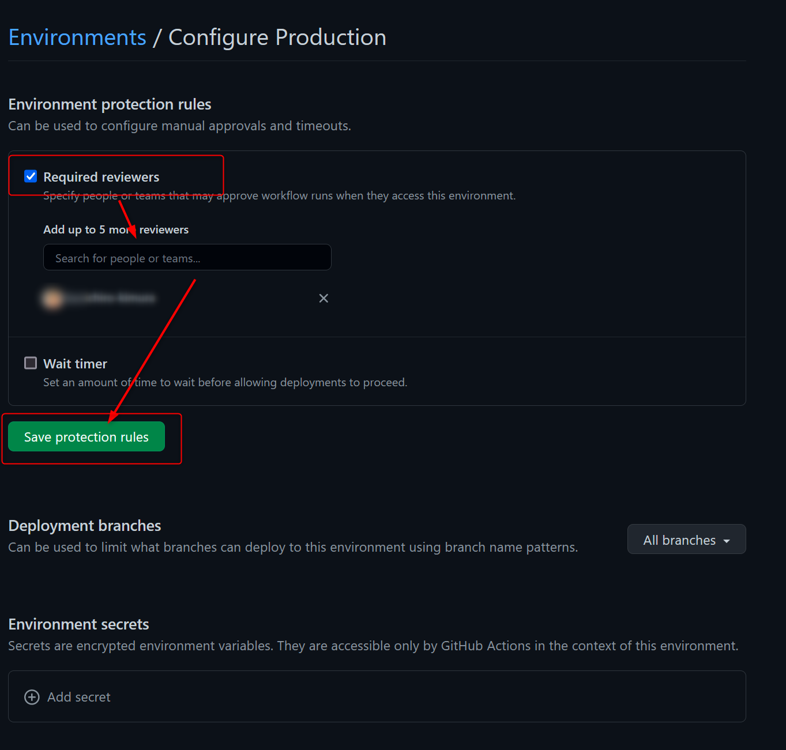
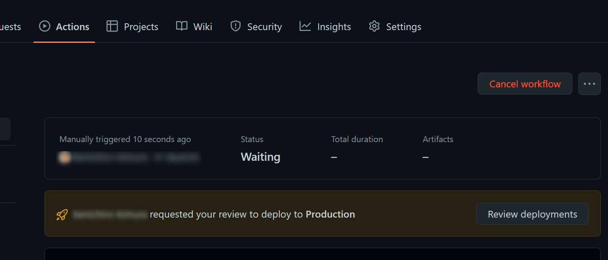

# おまけ

[本章完了までの時間の目安: 90 分]

ここまでの課題が早めに終わった方は、次の課題に取り組んでください。

## 課題 1: 承認フローの作成

実際の業務でも、本番環境へのデプロイについては上長の承認が必要というケースがあります。ここでは継続的デプロイの中にこの承認フローを組み込んでみます。

まず、リポジトリの設定から「環境」を作成します。「環境」は、デプロイターゲットを記述するために使用されます(例:Production/Staging/Development)。
GitHub Actions ワークフローでデプロイを実行する際に、事前に設定した環境を指定できます。

環境にはデプロイ保護機能があり、デプロイ保護機能が有効になっている環境へのデプロイは、承認が必要となります。また、環境ごとにシークレットを分けることができるので、デプロイ先を切り替えると言うことができます。

ここでは、Production 環境を作成します。環境名は Production とし、デプロイ保護機能を有効にします。デプロイ保護機能を有効にすると、 Production 環境へのデプロイは承認が必要となります。

「Settings」→「Environments」→「New environment」をクリックします。名前には「Production」と入力してください。



作成した Production 環境をクリックし、デプロイ保護機能を有効にします。「Required reviewers」にチェックを入れ、その下の入力枠にアカウント名を入力して検索し、デプロイを承認する人を指定します。ここでは、自分自身を指定します。



デプロイパイプラインで、 Production 環境を使うように記載します。ワークフローファイルに環境を指定するために、`environment`キーワードを使用します。
今回のパイプラインには既に`environment`で Production 環境を使う記載があるので、そのまま使います。

```yaml
jobs:
  ～～～

  deploy:
    permissions:
      contents: none
    runs-on: ubuntu-latest
    environment:
      name: 'Production'
      url: ${{ steps.deploy-to-webapp.outputs.webapp-url }}
```

承認フローを実行します。「Actions」から実行状況を確認すると、以下のように承認待ちになってフローが一時停止していることが分かります。



「Review deployments」をクリックすると、承認待ちの環境が表示されます。承認(Approve)するとデプロイが実行されること、却下(Reject)するとデプロイがキャンセルされることを確認してください。

## 課題 2: デプロイ先の切り替え

複数の環境を作り、それぞれにデプロイ先を切り替えることができます。ここでは、`Staging`環境を作成し、ステージング環境へのデプロイを実行する手順の概要だけ記載しますので、是非チャレンジしてみてください。

1. 作成した WebApps の SKU を S1 に変更(AppService Plan を変更)し、デプロイスロットを作成します
2. ステージング用のスロットの発行プロファイルを取得します
3. リポジトリの作成で`Staging`環境を作成します
4. `Staging`環境のシークレットに、ステージングスロットの発行プロファイルを設定します
5. `staging`ブランチにプッシュされたら、`Staging`環境を使用するようにワークフローを設定します

## 注意点

**S1 プランは月額費用が発生しますので、不要になったら必ず削除するようにしてください。**

---

＞[次のステップ（7. Appendix）](./07_appendix.md)   
＞[TOP](./../README.md)
